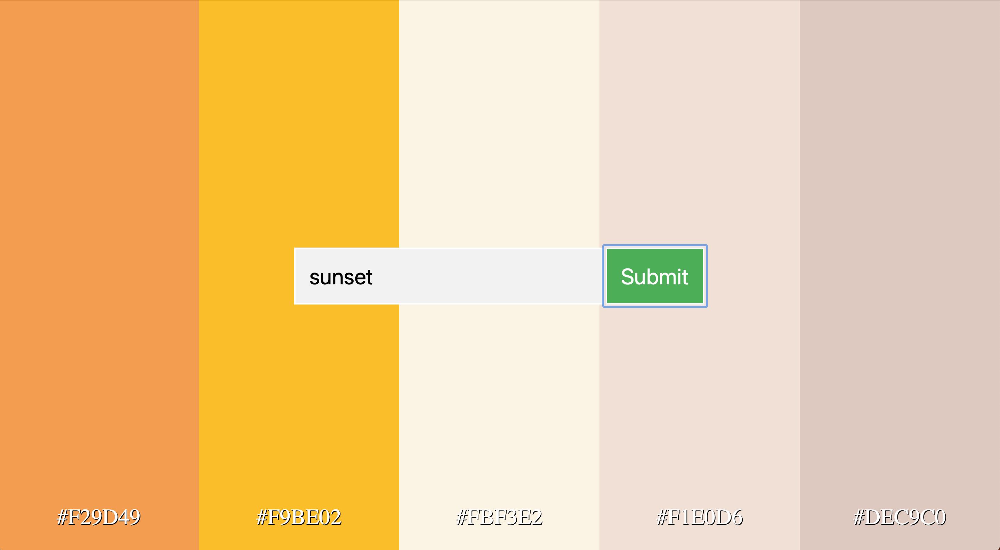

# Color Palette Generator

This is a project from an OPEN AI Udemy course.

## Install

```bash
$ git clone git@github.com:thedivloop/color-palette-gpt.git
$ cd color-palette-gpt
$ python3 -m venv venv
$ source venv/bin/activate
$ pip3 install -r requirements.txt
```

## Run the program

```bash
$ flask run
```

If you wanna automatic refresh while modifying the app:

```bash
$ flask run --debugger
```

Go to [http://127.0.0.1:5000](http://127.0.0.1:5000) or [http://localhost:5000](http://localhost:5000)

## Play with the program

Enter a free text request in the text input and click submit.

For example key in sunset and get something like this:


